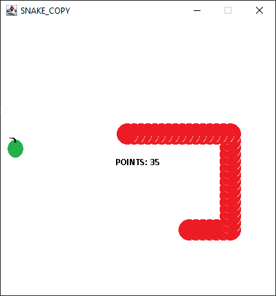

# Snake-game-demo

I built this project to further practice how game development works

This is a copy of Snake where the purpose of the game is to eat apples while trying to not crash into yourself.  
The project is built from scratch using pure Java with swing and AWT for graphics
---
  
